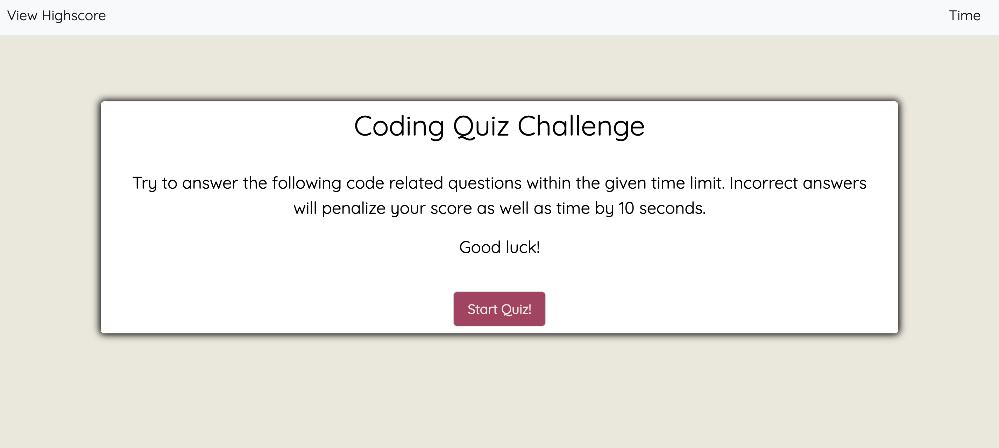

# multipleChoiceQuiz
A timer-based multiple-choice quiz application that stores high scores client-side.

The user arrives at the start page where time and score in the navigation bar are set to zero and is presented with a call-to-action to "Start Quiz."

When the user clicks "Start Quiz", he/she is presented with 5 differnt multiple choice questions. The timer is initialized with 75 seconds, allowing 15 seconds per question and immediately begins to count down.

The score is calculated by time remaining. Answering quickly and correctly results in a higher score. Answering incorrectly results in a time penalty. 15 seconds are subtracted from time remaining.

When time runs out and/or all questions are answered, the user is presented with his/her final score and asked to enter his/her initials. The user's final score and initials are then stored in localStorage.

